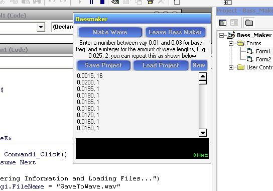



## Wave File 'Bass Maker' Program

### Description

Creates wave files from frequencies entered by the user via a text file. Good for testing out sound systems!! Use a really low frequency and watch your speakers move slowly in and out!!
 
### More Info
 

             |
---                |---
**Submitted On**   |2004-05-06 21:20:48
**By**             |[Alex Murray](https://github.com/Planet-Source-Code/PSCIndex/blob/master/ByAuthor/alex-murray.md)
**Level**          |Intermediate
**User Rating**    |4.6 (37 globes from 8 users)
**Compatibility**  |VB 5\.0, VB 6\.0
**Category**       |[Sound/MP3](https://github.com/Planet-Source-Code/PSCIndex/blob/master/ByCategory/sound-mp3__1-45.md)
**World**          |[Visual Basic](https://github.com/Planet-Source-Code/PSCIndex/blob/master/ByWorld/visual-basic.md)
**Archive File**   |[Wave\_File\_174240572004\.zip](https://github.com/Planet-Source-Code/alex-murray-wave-file-bass-maker-program__1-53581/archive/master.zip)

